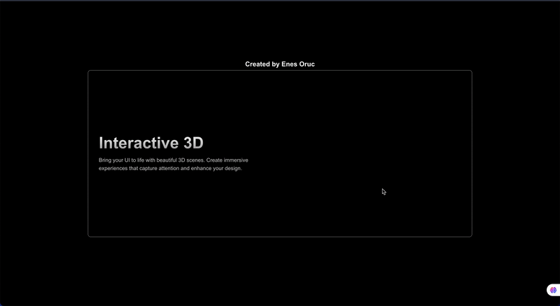

# Robot Tracker Page

The **Robot Tracker Page** is a Next.js project that features a robot animation that dynamically follows the user's mouse movements. Built with **Framer Motion** for smooth animations, the project incorporates modern Next.js features such as **lazy loading** and **use client** for optimal performance and interactivity.  

## Features

- **Mouse Tracking Animation**: A robot icon that follows the mouse pointer seamlessly across the screen.  
- **Framer Motion Animations**: Smooth and customizable animations for a dynamic user experience.  
- **Lazy Loading**: Ensures components and animations are loaded only when needed, improving performance.  
- **Next.js Features**:  
  - **`use client`**: Enables client-side interactivity within server-side rendered pages.  
  - **Dynamic Routing**: Easily extendable to support multiple pages with individual robot behaviors.  
- **Responsive Design**: Works on all devices and screen sizes.  

## Technologies Used

- **Next.js**: Framework for building server-side rendered React applications.  
- **Framer Motion**: Library for handling animations and transitions.  
- **CSS Modules/Tailwind CSS**: (Optional) Used for styling the application.  
- **React**: Core library for building the UI.  

# 3D-AI-next.js
